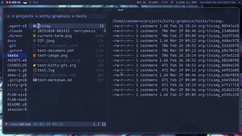
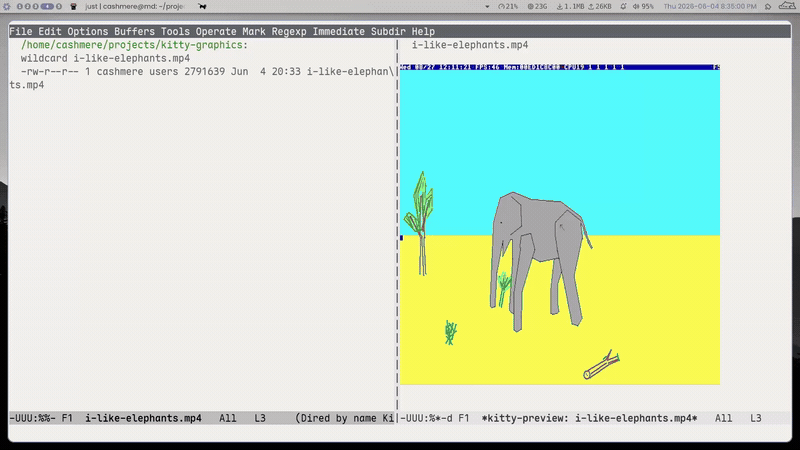

* Changelog

** kitty-graphics 1.0.3

Images show up again under kitty -> tmux -> emacs.  With =allow-passthrough= off the Kitty protocol can't traverse tmux, so detection fell back to Sixel, but kitty and ghostty have no Sixel support and tmux only drew its own =SIXEL IMAGE= placeholder.  Detection no longer falls back to Sixel when the outer terminal is kitty/ghostty and keeps pointing at =tmux set -g allow-passthrough on= instead; =kitty-gfx-doctor= stops reporting a misleading =sixel-ok yes= for this case.

** kitty-graphics 1.0.2

GIF previews work again.  Converting an animated GIF whole made ImageMagick write one PNG per frame, so the single target file never appeared and the preview looked like a conversion failure; the conversion now selects the first frame (=file[0]=, also for WebP) and produces the one still it expects.

Opening a GIF now animates it through mpv.  New ~kitty-gfx-play-gifs-with-mpv~ (default ~t~) routes an opened GIF to mpv playback while dired/dirvish browsing still shows the static first-frame thumbnail; set it to nil to keep GIFs as stills everywhere.

The video preview/playback buffer can be closed with =q= after the video ends.  The =q= binding lived only on the mpv overlay, which is deleted when playback stops, so under evil the normal-state =q= (record macro) shadowed it and the buffer could not be quit; =q= is now bound buffer-locally (and in evil normal state) the same way the image-mode buffer already did it.

** kitty-graphics 1.0.1

Sixel images no longer vanish a moment after they appear. On the Kitty backend an image is a persistent placement that survives redisplay, so the refresh loop skips it when its position is unchanged; Sixel pixels live in the text grid and any redisplay of those cells wipes them, and the unchanged-position skip meant nothing ever repainted. The refresh now re-emits Sixel images at an unchanged position instead of skipping them, so dired/dirvish previews and =image-mode= stay on screen in foot, Konsole, and other Sixel terminals.

The re-emit reuses the encoding instead of running the encoder again. Each overlay caches its encoded Sixel data in memory keyed on cell size, and a re-emit is deferred while the first encode is still in flight (the disk cache isn't written yet), so a large preview is encoded once rather than two or three times as redisplay timers fire during the blocking encode.

** kitty-graphics 1.0.0

The stable 1.0. Everything since =0.6.0= settles here: a redisplay engine that does nothing when nothing changed, background image conversion, multi-terminal daemon rendering, a reworked document viewer with zoom and pan, a diagnostic command, a timeout watchdog over every external process, and a long bug-sweep over the process, overlay, and protocol lifecycles.

*** Documents

Doc-view was reworked: pages render centered in the window, =n= / =p= flip pages, and =+= / =-= / =0= zoom. On the Kitty backend a zoomed page is clipped to the window and panned by scrolling (pdf-tools style); on Sixel the page renders at fit size. PDF, DVI, PostScript, and EPUB all use the same path, and the doc-view welcome text is hidden so a page is the only thing on screen.

Conversion is converter-agnostic: when MuPDF's =mutool= is on ~PATH~ doc-view uses it automatically (faster and sharper for PDFs), and Ghostscript still works. The SVG page path is guarded so doc-view's MuPDF SVG output is rasterized to PNG before placement.

*** Diagnostics and reliability

New ~kitty-gfx-doctor~ prints a report: active backend, queried cell size and text-sizing level, tmux state, the resolved Sixel encoder, and which relied-on external programs are installed. When a terminal is unsupported the mode now says why (graphical frame, tmux passthrough off, tmux too old for Sixel, or an unrecognized TERM) instead of just refusing, and a missing ImageMagick is surfaced once on both the synchronous and background conversion paths instead of images silently never appearing.

Every blocking external command (ImageMagick, identify, ffmpeg, typst) runs under a watchdog bounded by new ~kitty-gfx-process-timeout~ (default 15s), so a corrupt or pathological file can no longer freeze Emacs. The Sixel encoder keeps its own ~kitty-gfx-sixel-encoder-timeout~; both share one process runner.

The cell-size and text-sizing startup probes are deferred off the mode-enable path, so they no longer consume kkp.el's asynchronous keyboard-protocol reply (which could break kkp depending on tty-setup hook order).

*** Performance

Refreshes are now skipped entirely when nothing on screen changed: each visible image window stores a cheap signature (buffer, modification tick, displayed region, hscroll, pixel size) after a successful refresh, and the post-command scheduler does nothing while every signature still matches. New ~kitty-gfx-skip-clean-refresh~ (default ~t~) is the escape hatch.

Non-PNG images (jpeg, webp, svg, ...) are converted to PNG in a background process instead of blocking Emacs, controlled by new ~kitty-gfx-async-conversion~ (default ~t~); the overlay reserves its space immediately and the image appears via a forced refresh once the conversion lands. Conversion results are cached per file mtime, so repeat displays skip ImageMagick altogether.

Transmitting an image to a terminal that does not hold its data yet (a freshly attached daemon client, or a first display) no longer happens synchronously inside the refresh loop: transmits go through a queue drained one image per timer tick, keeping keystrokes responsive while a new client catches up.

Base64 payloads are cached in memory keyed on file and mtime, bounded by new ~kitty-gfx-base64-cache-bytes~ (default 64 MiB, LRU eviction), so sending the same image to a second terminal skips the read and encode cost.

*** Headings

OSC 66 heading widths are now computed with ~string-width~ instead of character count, so CJK and emoji headings get their full double-width footprint for placement, erase, and collision detection.

Editing a scaled heading no longer makes it vanish and reappear: the overlay stays in place, the buffer text shows at normal size while you type, and a debounced rescan updates the heading text, width, and OSC 66 rendering in place. A line that stops being a heading (or moves to an unscaled level) drops its overlay cleanly, and typing at the end of the heading is now detected at all.

Heading instrumentation is lazy by default: only the displayed window region plus two screenfuls of margin is scanned, driven by scroll and window-change hooks, which keeps activation instant in buffers with thousands of headings. New ~kitty-gfx-heading-scan-visible-only~ (default ~t~); set to ~nil~ for the old full-buffer scan.

Scaled headings no longer overwrite inline images: the emit phase seeds its occupied-row set from the image placements recorded on the target terminal and skips any heading that would overlap them, exactly like heading-heading conflicts.

Enabling heading sizes no longer unfolds the whole buffer; folded and collapsed headings simply render as plain text until revealed.

Live-terminal rendering is now stable: each heading reserves exactly its scaled width in spaces (clamped to the window, with the OSC 66 payload truncated to fit) and the reservation is flushed to the terminal before the block is painted, so Emacs redraws no longer clip the leading glyphs, no truncation marker appears, and over-wide reservations are gone. Erases are only ever emitted at freshly measured coordinates immediately before a placement; folds, scrolls, edits, and buffer switches rely on Emacs redrawing the reserved cells instead, which stops stale-coordinate erases from blanking real buffer text. Two live-testing fixes on top: screen columns now include the ~display-line-numbers~ width (headings and images no longer paint over or get clipped by the number column), and a heading that moves without a window scroll — or any visibility cycle via ~org-cycle~ — gets its old multicell block erased at the still-valid cached coordinates, eliminating ghost fragments after S-TAB and fold changes. Scrolls erase the emitted blocks from the scroll hook, before the window is redrawn while their cached coordinates still match the screen, so redraw-style scrolls can no longer leave clipped giant-glyph fragments at the old position.

The minor modes disabled while heading sizes are active are now customizable via new ~kitty-gfx-heading-conflicting-modes~ (default matches the old hardcoded list).

When the same org buffer is shown in several windows or terminals, one canonical window per buffer (preferring the selected window) renders the scaled headings; all other windows show plain heading text instead of flickering. Per-window heading rendering is a known limitation.

*** Sixel and tmux

Sixel encoding gained tuning knobs: new ~kitty-gfx-sixel-dither~ (nil for the encoder default, ~"none"~, ~"fs"~, or ~"atkinson"~) and ~kitty-gfx-sixel-colors~ (palette size, default 256) map onto img2sixel's ~-d~/~-p~ and ImageMagick's ~-dither~/~-colors~ flags; ~kitty-gfx-sixel-encoder-args~ remains the raw escape hatch appended after them. ImageMagick now resizes before quantizing, so the palette reduction actually sticks. Dropping to 16 colors with dithering off cuts the test-image payload from 2042 to 1412 bytes (img2sixel) and 4904 to 1712 (magick).

When img2sixel encodes a source image larger than the target pixel box and ImageMagick is available, the image is first pre-scaled to a temp PNG (bounded by the same timeout watchdog as encoder runs) and img2sixel encodes that without ~-w~/~-h~, so quantization runs on the small image instead of the full-size one. The temp PNG is deleted after encoding; cache keys are unchanged.

A failed or timed-out Sixel encode is no longer silent blank cells: the overlay shows a visible =[sixel: encode failed]= marker, a one-time message (per file, per session) names the encoder and whether the timeout watchdog killed it, and the failing overlay is not retried on every refresh. The failure marker records the file's mtime, so changing the file on disk (or re-displaying the image) retries the encode instead of sticking until Emacs restarts.

tmux detection is now per terminal: the tmux version cache moved from a global to a terminal parameter, and the version is asked from each client's own tmux server (socket derived from that frame's TMUX env var) so daemon clients sitting in different tmux servers detect independently. When Sixel inside tmux is refused for an old tmux, the message names the detected version and the 3.4 minimum.

New ~kitty-gfx--tmux-passthrough-p~ queries =#{allow-passthrough}= on the client's tmux socket (cached per terminal, ~on~/~all~ count as enabled). When the outer terminal speaks the Kitty protocol but tmux passthrough is off, the Kitty backend is no longer selected blindly — detection emits a one-time message with the exact fix (=tmux set -g allow-passthrough on=) and falls through to Sixel when available.

*** Features

**** Inline mpv video on the Sixel backend (experimental)

~kitty-gfx-play-video~ now also works on the Sixel backend via mpv's native ~--vo=sixel~ output, sharing the whole kitty-vo pipeline (PTY frame forwarding, IPC pause/seek/reposition, hidden-buffer auto-pause). Requires an mpv built with libsixel (probed once via =mpv --vo=help=, with a Nix override hint when missing); the existing ~kitty-gfx-sixel-dither~ and ~kitty-gfx-sixel-colors~ defcustoms tune the frame encoding.

**** Multi-tty daemon support

Graphics now work under =emacs --daemon= with several =emacsclient -t= clients at once. Placements, image transmissions, and cleanup are routed per client terminal: each terminal keeps its own backend detection, cell size, text-sizing level, and transmitted-image set, and every refresh batch runs in its own synchronized-output block on the right tty. Inline video (mpv) and the casty browser stay bound to the terminal they were launched on. New ~kitty-graphics-setup~ is the daemon-aware entry point, and =just test-daemon*= recipes drive an isolated daemon for multi-client testing.

**** shr image scaling (eww, elfeed, mu4e, gnus)

New ~kitty-gfx-shr-scale~ controls how images render through shr, so feed
images no longer dominate the buffer at full natural size. Set it to a
float (e.g. ~0.25~) to render every image at a fraction of its natural
size, or to ~fit~ for dynamic, window-relative sizing: each image is
scaled into a box of ~kitty-gfx-shr-fit-width~ (fraction of the window
width, default 0.6) by ~kitty-gfx-shr-fit-height~ rows (default 20),
preserving aspect ratio and never enlarging images that already fit. The
box tracks the live window. Default ~nil~ keeps the previous behaviour
(natural size, shrink-to-fit ~kitty-gfx-max-width~ / ~kitty-gfx-max-height~).

*** Fixes

A bug-sweep pass over process, overlay, and protocol lifecycles, verified finding by finding.

Placeholder mode (the default inside tmux) no longer shows a top-left crop of downscaled images: the virtual placement is registered with the rendered cell dimensions (~c~/~r~) at placement time and re-registered when they change. Direct placements inside tmux also stopped leaking their cursor movement through the passthrough envelope (it now executes pane-relative, only the APC is wrapped), the placement mode is resolved from the target client's environment under a multi-tty daemon, and images larger than the 297-cell placeholder grid (image-mode zoom) are clamped instead of aborting every refresh cycle.

The cell-size and text-sizing startup probes no longer eat your keystrokes: typing while the probe waits (an =n= or =t= used to terminate the read early) leaked the real terminal reply into the command loop as garbage keys; both readers now complete only on a full match of the expected reply and push anything else back as input. OSC 66 heading text is capped at the protocol's 4096-byte limit on a UTF-8 boundary.

mpv playback started from dired (or any window switch at the wrong moment) no longer loses its IPC connection to whatever buffer was current when the socket appeared — pause, auto-pause, repositioning, and cleanup work again, and the connection no longer leaks. The IPC socket pollers for mpv and casty are cancellable and stop on their own when the session is gone, a quit during a Sixel encode no longer leaves the encoder process running, the blank lines ~kitty-gfx-play-video~ inserts are removed when playback ends, and converted temp PNGs plus stale IPC sockets are deleted when Emacs exits instead of piling up in /tmp.

The casty browser stops painting over unrelated buffers when no window shows it: frames are suppressed and the image is dropped, then repainted when the buffer is shown again, mirroring mpv's auto-pause. Its stderr log buffer is killed with the last browser session. mpv and casty are no longer offered inside tmux at all — their raw frame streams bypass the passthrough wrapper and could only render blank — and the unavailable-reason messages say so.

Disabling ~kitty-graphics-mode~ now actually cleans up: blank image overlays and space-displayed scaled headings are removed from all buffers (with conflicting minor modes restored) before the backend state is reset, so re-enabling heading sizes works instead of erroring. Killing a buffer deletes its real per-window placements (not a never-emitted overlay id) on the terminals they were painted on, ~revert-buffer~ and major-mode switches no longer orphan overlays and placements, and ~kitty-gfx-clear-all~ no longer resets the image id counter under a live browser session (a later allocation could clobber the browser frame).

** kitty-graphics 0.6.0

Three headline additions land in =0.6.0=: inline video playback, an
inline web browser, and Kitty graphics that finally work through tmux.
Videos now play right inside a terminal Emacs buffer via [[https://mpv.io][mpv]], with
thumbnail and full-frame previews in dired/dirvish.  The browser embeds
[[https://github.com/cashmeredev/casty][casty]] (a headless-Chrome bridge) over an IPC socket, so you can drive a
real web page inside a buffer.  And the tmux work wraps Kitty's APC
sequences in DCS passthrough plus a Unicode-placeholder placement mode
so images survive pane and window switches.  =0.5.0= shipped Sixel
inside tmux and typst; =0.6.0= builds on that foundation.

*** Features

**** Inline mpv video playback (Kitty backend)

Play videos right inside a terminal Emacs buffer via [[https://mpv.io][mpv]] and the
Kitty graphics protocol.  mpv runs on a PTY with =--vo=kitty=, its frame
stream is forwarded to the terminal, and a JSON IPC socket drives
pause/resume.  Commands: =kitty-gfx-play-video=, =kitty-gfx-toggle-video=
(=SPC=), =kitty-gfx-stop-video=, =kitty-gfx-stop-video-and-back= (=q=),
=kitty-gfx-video-help= (=?=).  dired and dirvish gained inline previews:
video thumbnails in the preview pane plus =kitty-gfx-dired-play-video= and
=RET= full-frame playback (opt-in =kitty-gfx-dirvish-video-inline-preview=,
thanks to [[https://github.com/unship][unship]]'s frame-placement work).  Falls back gracefully with
an ffmpeg warning when a thumbnail cannot be extracted.  Kitty backend
only -- the Sixel re-emit cost makes per-frame video impractical.
Requires mpv >= 0.36.0 with =--vo=kitty= support; enable with
=kitty-gfx-enable-video=.

**** Inline web browser (experimental)

=kitty-gfx-browse= embeds a real Chromium page inside an Emacs buffer
by driving [[https://github.com/cashmeredev/casty][casty]] (my fork of [[https://github.com/sanohiro/casty][sanohiro/casty]], MIT) in its embed
mode: casty renders the page to PNG frames over the Kitty graphics
protocol while Emacs forwards scroll, navigation, clicks, and
Vimium-style link hints over an IPC socket.  Evil normal/motion
bindings are mirrored by default.  Enable with =kitty-gfx-enable-browser=
and point =kitty-gfx-casty-program= at the casty launcher.  Experimental;
Kitty terminal only.

**** Kitty graphics protocol inside tmux

Two pieces together let the Kitty backend work through tmux DCS
passthrough end-to-end — the half left open in =0.5.0= (see #2).

***** tmux DCS passthrough wrap + Ghostty detection

Inside tmux, Kitty graphics APC sequences (=ESC _ G ... ESC \=) are
stripped by tmux before reaching the outer terminal.  =kitty-gfx--
terminal-send= now wraps payloads that contain a =\e_G= APC with
the standard =\ePtmux;<doubled-ESC>\e\\= envelope so they pass
through when =allow-passthrough on= is set.  Plain CSI, SGR, OSC,
and text remain unwrapped — tmux handles those natively and needs
to see them to keep its own grid in sync.

New custom: =kitty-gfx-tmux-passthrough= (default =t=).

The Kitty-backend detector previously matched on =TERM_PROGRAM=,
which tmux masks to =tmux=, so terminals like Ghostty went
unrecognised inside a multiplexer.  =kitty-gfx--kitty-detect= now
also accepts =GHOSTTY_RESOURCES_DIR= / =GHOSTTY_BIN_DIR= and
=WEZTERM_EXECUTABLE= as evidence the outer terminal speaks the
protocol.

***** Unicode placeholder placement (no ghost on pane switch)

Adds the Kitty graphics protocol's Unicode-placeholder placement
mode as an alternative to the existing absolute =a=p,c,r= form.
Placeholder cells (=U+10EEEE= + row/col diacritics, fg color
encoding the image id) live in the multiplexer's character grid as
ordinary text, so pane / window switches and buffer scrolling are
handled by the multiplexer naturally — there is no terminal-side
pixel-layer ghost to clean up.

New custom: =kitty-gfx-kitty-placement-mode= with values =auto=
(default), =direct=, =placeholder=.  =auto= resolves to
=placeholder= inside tmux and =direct= otherwise.

Implementation notes that may be relevant to anyone porting this to
another Emacs image package:

- Emacs' TTY display engine drops combining diacritics that attach
  to private-use base characters such as =U+10EEEE=, which would
  silently break the protocol if placeholder cells went through
  =display= properties.  The actual placeholder bytes are written
  via =send-string-to-terminal= from
  =kitty-gfx--emit-placeholder-cells=; the overlay's =display=
  string still reserves screen real estate as blank cells, so the
  terminal has somewhere consistent to paint.
- =a=T,U=1= (transmit-and-virtual-place in one APC) caused
  Ghostty 1.3.x to also draw the image once at the cursor position
  at transmit time, producing a ghost copy.  Splitting into =a=t=
  + a separate =a=p,U=1= avoids the cursor-position render.
- =U+10EEEE='s default east-asian width is 2; the protocol
  requires width-1 cells.  =char-width-table= is pinned to 1 for
  that code point at load time.
- When an overlay moves (or is deleted) the cells it previously
  occupied are overwritten with spaces, otherwise the image
  continues rendering at the stale location in the multiplexer's
  grid.  The image data on the terminal side is kept either way so
  a re-place does not require a re-transmit.

Refs #2.

** kitty-graphics 0.5.0

A feature-heavy follow-up to =0.4.0=: typst inline equations, a much
more robust Sixel encoder pipeline, and Sixel inside tmux.  =0.4.0=
already shipped the Sixel backend and the text-sizing protocol; =0.5.0=
builds on that foundation.  (Inline mpv video landed after this tag and
ships in =0.6.0=.)

*** Features

**** Typst inline equation preview

New autoloaded commands =kitty-gfx-typst-preview= and
=kitty-gfx-typst-clear-preview= scan the current buffer (or active
region) for ~$...$~ math fragments, compile each one via the =typst=
CLI, and replace it with a rendered PNG using the existing
kitty-graphics overlay pipeline.  Works on both the Kitty and Sixel
backends.  Customs: =kitty-gfx-typst-command=, =kitty-gfx-typst-ppi=,
=kitty-gfx-typst-text-size=, =kitty-gfx-typst-preamble=.  Default
preamble auto-converts the current Emacs foreground colour to the hex
form typst's =rgb()= requires.  Cached PNGs land under
=/tmp/kitty-gfx-typst/= keyed by SHA-1 of the source.  Closes #5.

**** Configurable Sixel encoder + per-invocation timeout

The Sixel encoder pipeline used to be hard-wired to ImageMagick with
no timeout, so a malformed image or a hung encoder could freeze
Emacs.  Three new customs and two helpers fix that:

- =kitty-gfx-sixel-encoder-program= (nil = auto-detect).  Auto-detect
  order: =img2sixel= (libsixel) > =magick= (ImageMagick 7) > =convert=
  (ImageMagick 6, deprecated).  Set to a string to pin a specific
  binary.
- =kitty-gfx-sixel-encoder-args= -- extra arguments slotted before
  the per-invocation size flags.
- =kitty-gfx-sixel-encoder-timeout= -- float seconds, default =5.0=,
  =nil= for no timeout.

Internally =kitty-gfx--sixel-resolve-encoder= returns a
=(KIND . PATH)= cons so the encode pipeline can build the right
argv (=-w/-h <px>= for img2sixel, =-geometry WxH sixel:-= for
ImageMagick), and =kitty-gfx--sixel-run-encoder= drives the child via
=make-process= with a separate stderr buffer and a =run-at-time=
watchdog that kills the process on timeout.  Failures and timeouts
surface as a logged =nil= instead of a frozen Emacs.

#+begin_QUOTE
*Bench*: =tests/test-image.png= encoded at 20×10 cells (160×160 px) on
my workstation -- =img2sixel= produced =2631=-byte payloads in
~5 ms, =magick= produced =5831=-byte payloads in ~58 ms.  About =2.2x=
smaller payload and =~10x= faster.  This matters most inside tmux,
where every refresh re-emits the full DCS payload.
#+end_QUOTE

Pattern adapted from [[https://github.com/timfel/sixel-graphics.el][@timfel's =sixel-graphics.el= fork]]; co-authored
on the commit.  Refs #4.

**** Sixel inside tmux >= 3.4

The Sixel detector used to hard-disable the moment =$TMUX= was set --
that comment in the code predated tmux =3.4= (released =2024-02-13=),
which ships native Sixel rendering.  Drop the hard guard, gate on a
parsed =tmux -V=, and let users opt out via
=kitty-gfx-tmux-allow-sixel= (default =t=).  New helpers
=kitty-gfx--tmux-version= (cached) and
=kitty-gfx--tmux-sixel-supported-p= centralise the in-tmux + opt-in +
version-check logic.  The =sixel-detect= debug log gained =tmux-ver==
and =tmux-ok== fields.

Caveat: tmux's cell buffer is not pixel-aware, so images may stick to
their old position after scrolling until the affected cells are
overwritten.  That's an upstream tmux limitation, not something this
package can fix.  The Kitty graphics protocol still does not work
inside tmux because we do not yet wrap APC sequences with the
=\ePtmux;...\e\\= passthrough envelope -- separate piece of work.
Refs #2.

**** Loud warning on missing Sixel encoder

When the Sixel backend is selected but no encoder is on =PATH=, the
mode-enable now fires a =display-warning= pointing at
img2sixel/ImageMagick instead of silently dropping every image.

**** Windows Terminal detection + GIF routing

Windows Terminal does not advertise a stable =TERM= value, so the old
detector missed it.  Accept the =WT_SESSION=, =WT_PROFILE_ID= and
=WT_WINDOWID= environment markers it injects and the Sixel backend
engages correctly.  =gif= is also now routed through the image
pipeline (still first-frame only -- no animation support in the
terminal -- but no longer silently dropped).  Closes #6.

Thanks again to [[https://github.com/timfel][Tim Felgentreff]] for the patch and the Windows-side
testing.

*** Fixes

- ECH-erase + pre-erase pattern for cleaner column clearing.  Credit
  to [[https://github.com/mdfried][mdfried]] for the approach.
- Skip heading rendering when folded to the same visual line.
- Sixel backend parity with the Kitty backend across the refresh
  cycle.
- Text sizing rendering: column guard, CPU optimisation, preview-mode
  behaviour.

*** Tooling

- New top-level =justfile= task runner with byte-compile, load, and
  per-feature interactive recipes (=test-org=, =test-typst=,
  =test-image=, =test-sixel-image=, =test-sixel-tmux=, ...) plus
  headless probes (=sixel-encoder=, =sixel-encode [ENCODER]=,
  =sixel-timeout-test=, =typst-render=).

*** Documentation

- =README.org= and =AGENTS.md= now hard-state img2sixel as the
  recommended Sixel encoder, with the bench numbers above and a
  pointer to =just sixel-encoder= as the first step when diagnosing
  Sixel rendering bugs.

*** Credits

Thanks to [[https://github.com/timfel][Tim Felgentreff]] for the encoder + timeout pattern and the
ongoing collaboration on the Sixel side via his fork.

** kitty-graphics 0.4.0 - HUGE updates

*** Features

- Full sixel support
- Abstracted the library to support =kitty-gfx-protocol= and =sixel=
- Support for agent-shell
  Thanks to [[https://github.com/Lenbok][Lenbok]]
- First implementation of the text sizing protocol

**** Sixel support!

Yes, you are reading it right! The library now supports displaying images in Terminals also to those, who support sixel, which opens up the support for almost the rest of the up to date terminals.

Tested and confirmed working in =foot=, =xterm=, =Konsole=, =mlterm=, and =mintty=. Auto-detection probes for Sixel support via DA1 query. If your terminal supports it, kitty-graphics will use it automatically.

#+begin_WARNING
Performance wise, the kitty image protocol is superior in terms of speed and actual image quality (truecolor vs 256 colors). If your terminal supports it, prefer the kitty protocol.
#+end_WARNING

***** Showcase

**** Text sizing protocol

Yes, we do even now support the text sizing protocol inside Emacs terminal mode! Nonetheless, take that feature with a grain of salt. This protocol is rather new compared to the others, and there are not many references which implement it.

After many attempts, I was able to add something genuinely useful. Org Mode remains my highest priority, of course.

We can render org headings at scaled sizes (=* Heading= at 2x, =** Sub= at 1.5x, =*** Deep= at 1.2x). A preview mode temporarily disables conflicting packages (org-modern, org-appear, olivetti, etc.) for clean rendering. Toggling images does also work, though currently not while the text protocol is active at the same time.

I will keep on improving this feature. I think it is actually great eyecandy, and something I had never seen before and had not even known about until somebody mentioned it under one of my threads on Reddit. If you, /anon/, feel mentioned, a big thanks to you!

*Requires Kitty >= 0.40.0* (the only terminal currently implementing OSC 66 with scale support).

***** Showcase

*** Bug fixes & polish

- Text sizing: added column guard to prevent out-of-bounds rendering, CPU optimization (reduced redundant redraws), improved preview mode stability
- Sixel backend parity improvements: better interop with the kitty protocol path
- Heading rendering: skip overlay emission when a heading is folded to the same visual line (prevents ghost glyphs)
- Erase strategy: switched to ECH erase + pre-erase pattern (credit: mdfried) for cleaner column clearing

*** What comes next?

**** tmux support

tmux support is in progress.  The Sixel side is unlocked in =0.5.0= --
see the entry above.  Native Kitty graphics passthrough inside tmux is
still pending: we do not yet wrap APC sequences with the
=\ePtmux;...\e\\= envelope, and there's also an in-progress branch
adding [[https://github.com/tmux/tmux/tree/ta/kitty-img][native Kitty image protocol support to tmux]].  Until either
lands, if you already use Kitty directly I would stick with it --
the Kitty protocol gives you stateful image management, truecolor
rendering, and a smoother overall experience.

**** Package renaming?

I was thinking about renaming the project into something like =terminal-gfx= as we do now cover not only one way of displaying images, but also take an approach to stabilize the =text-protocol=. This is my first project with people actually using and/or are interested in what I do =:D=. So if you have suggestions or feedback, I would love to hear your opinion!

/In terms of actually renaming the package, I will do it in such a manner, that your current and future configurations are not going to break. Shoutouts to neovim and its stable ecosystem *hust hust*./
