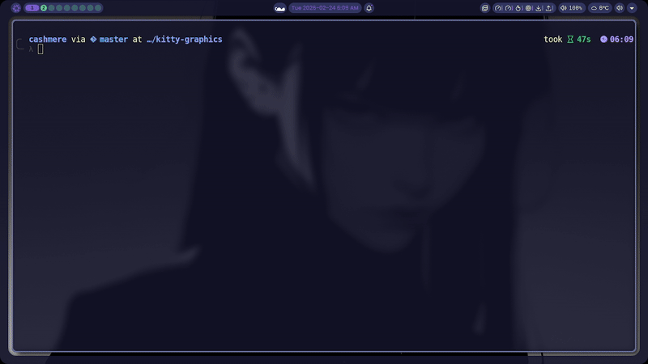
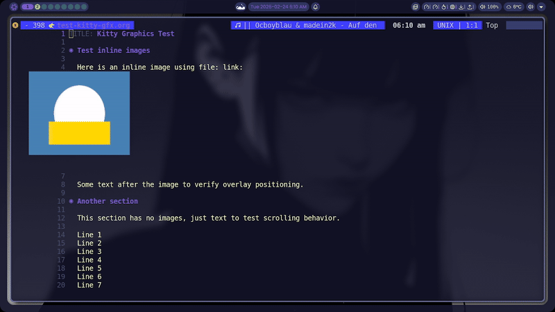

#+TITLE: kitty-graphics.el
#+AUTHOR: cashmere

Display images in terminal Emacs (~emacs -nw~) using the [[https://sw.kovidgoyal.net/kitty/graphics-protocol/][Kitty graphics protocol]].

* Demo

* Foreword

I got the opportunity to subscribe to the highest Claude level. I'm allowed to use it outside of work. I was able to extend Emacs in terminal mode with the kitty protocol. Out of curiosity I wanted to know if a thought I had for months was possible or not, which was basically to extend libvterm with the kitty image protocol and then utilize vterm to display those images inside Emacs Terminal.

Besides, I don't even have the guts to release it, even though my intention of such a release would be first and foremost for the people who have been asking for such a feature specifically for years, or for other developers to use it as some kind of reference. So idk, while I totally agree that the current AI slop is getting to be exhausting, we as humans should judge projects on a project by project basis.

* Overview

~kitty-graphics.el~ renders images directly in terminal Emacs using Kitty's
graphics protocol with direct placements. Images are transmitted once to the
terminal, then positioned at overlay screen coordinates after each redisplay.
They scroll with text, survive buffer switches, and work in split windows ---
they're managed as overlays in Emacs's display engine.

Integrations are provided for:
- *org-mode* --- inline images via =C-c C-x C-v= (both =org-toggle-inline-images= and =org-link-preview= for org 10.0+)
- *org LaTeX preview* --- render LaTeX fragments as images via =C-c C-x C-l=
- *doc-view* --- PDF/DVI/PS viewing with page navigation and zoom
- *image-mode* --- terminal-aware image file viewing
- *shr/eww* --- inline images in HTML rendering (eww, mu4e, gnus)
- *dired* --- image preview in side window (=P= key)
- *dirvish* --- native preview dispatcher for image files

* Requirements

- Emacs >= 27.1
- [[https://sw.kovidgoyal.net/kitty/][Kitty]] >= 0.20.0 (or WezTerm/Ghostty with direct placement support)
- ImageMagick (~magick~ / ~convert~ / ~identify~) for non-PNG formats and image sizing
- For LaTeX preview: a TeX distribution with ~dvipng~ (e.g. ~texlive~)
- For doc-view: ~ghostscript~ (for PDF), ~dvipng~ (for DVI) --- same tools as GUI Emacs
- Launch Emacs with ~TERM=xterm-256color~ (Emacs often can't find the ~xterm-kitty~ terminfo)
  
  #+begin_src sh
  TERM=xterm-256color emacsclient -nw
  #+end_src

* Installation

** straight.el

#+begin_src emacs-lisp
(use-package kitty-graphics
  :straight (:local-repo "~/projects/kitty-graphics")
  :if (and (not (display-graphic-p)) (getenv "KITTY_PID"))
  :config
  (kitty-graphics-mode 1))
#+end_src

** Manual

#+begin_src emacs-lisp
(add-to-list 'load-path "~/projects/kitty-graphics")
(require 'kitty-graphics)
(when (and (not (display-graphic-p)) (getenv "KITTY_PID"))
  (kitty-graphics-mode 1))
#+end_src

* Usage

Enable the global minor mode:

#+begin_src emacs-lisp
(kitty-graphics-mode 1)
#+end_src

Then:
- In org-mode: toggle inline images with =C-c C-x C-v=
- In org-mode: preview LaTeX fragments with =C-c C-x C-l= (requires a LaTeX installation and =dvipng=)
- Open a PDF: =doc-view-mode= renders pages via Kitty (=n= / =p= to navigate, =+= / =-= / =0= to zoom)
- In dired: press =P= on an image file for a side-window preview
- In dirvish: image previews work automatically (no extra config)
- Open an image file: =image-mode= displays it via Kitty
- In eww/mu4e/gnus: HTML images render inline

** Commands

| Command                 | Description                        |
|-------------------------+------------------------------------|
| ~kitty-graphics-mode~     | Toggle the global minor mode       |
| ~kitty-gfx-display-image~ | Display a single image at point    |
| ~kitty-gfx-remove-images~ | Remove images in region or buffer  |
| ~kitty-gfx-clear-all~     | Remove all images from all buffers |
| ~kitty-gfx-dired-preview~ | Preview image at point in dired    |

** Customization

| Variable               | Default | Description                              |
|------------------------+---------+------------------------------------------|
| ~kitty-gfx-max-width~    |     120 | Maximum inline image width in columns    |
| ~kitty-gfx-max-height~   |      40 | Maximum inline image height in rows      |
| ~kitty-gfx-render-delay~ |   0.016 | Debounce delay for re-rendering (s)      |
| ~kitty-gfx-debug~        |     nil | Log debug info to ~/tmp/kitty-gfx.log~     |

These defaults control inline image sizing (org-mode, eww, dired previews).
Doc-view ignores these and fills the window, with =+= / =-= / =0= for zoom.

* How It Works

1. On startup, cell pixel size is queried via ~CSI 16 t~ (XTWINOPS) for
   accurate image scaling. Falls back to 8x16 if the query times out.
2. Image data is transmitted once via APC escape sequences (~a=t~, store only)
3. Overlays with a ~display~ property reserve blank space in Emacs buffers
4. After each redisplay, direct placements (~a=p~) are emitted via
   ~send-string-to-terminal~ at the overlay's screen coordinates
5. All placement output is wrapped in synchronized output (~BSU/ESU~,
   =DEC mode 2026=) to prevent partial rendering and flicker
6. Each placement uses a unique placement ID (~p=PID~) so re-placements
   at new positions replace the old rendering without accumulation
7. Position caching skips redundant re-placements when nothing moved
8. Placements are deleted when overlays scroll out of view

* Supported Formats

PNG is sent directly to the terminal. Other formats (JPEG, GIF, WebP, SVG,
TIFF, BMP) are converted to PNG via ImageMagick before transmission.

* Known Limitations

- No tmux support 
- Primary focus on kitty terminal. While other terminals should work too, I wont give any guarantee
- Animated GIFs display only the first frame
- Without ImageMagick, only PNG files work and image sizing falls back to a fixed default
- Doc-view page may briefly flash at wrong position before centering on initial load

* License

GPL-2.0-or-later
